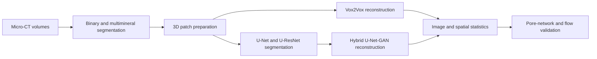

# Deep Learning for 3D Reconstruction of Porous Media

Research code and reproducibility materials accompanying Bahareh Keshavarz's doctoral thesis on segmentation-informed three-dimensional reconstruction of multimineral porous media.

The thesis document and abstract are not included in this repository.

**Persian title:** بهبود بازسازی سه‌بعدی محیط‌های متخلخل با استفاده از داده‌های بخش‌بندی تصاویر بر مبنای بافت سنگ با رویکرد یادگیری عمیق

The project investigates whether mineral and rock-texture information can improve the geometric and physical fidelity of reconstructed digital rocks. It connects three related studies: multimineral-conditioned Vox2Vox reconstruction, 3D U-Net/U-ResNet segmentation, and a hybrid U-Net-GAN reconstruction model.

## Highlights

The following are **reported thesis/publication results**, not results of the maintained synthetic examples below.

- Multimineral Vox2Vox conditioning achieved SSIM 0.95, MSE 0.00013, and PSNR 38.93 dB, compared with 0.89, 0.00112, and 29.49 dB for binary conditioning.
- The U-ResNet segmentation experiments reached an F1 score of approximately 0.95.
- The hybrid model reproduced porosity of 36.3% versus 35.5% for the reference volume and absolute permeability of 263 mD versus 259 mD.
- Across six pore-throat network descriptors, the mean absolute error was 7.17% for texture-informed reconstruction and 33.83% for binary reconstruction.

## Workflow



## Notebooks

Six maintained notebooks run independently on small synthetic inputs by default. Only the maintained versions are included in the current repository; older experimental notebooks are excluded.

| Order | Notebook | Purpose |
| --- | --- | --- |
| 01 | [`01_data_preparation.ipynb`](notebooks/01_data_preparation.ipynb) | Validate volumes, define splits, and create aligned 3D patches |
| 02 | [`02_vox2vox_reconstruction.ipynb`](notebooks/02_vox2vox_reconstruction.ipynb) | Compare binary and multimineral Vox2Vox reconstruction |
| 03 | [`03_unet_uresnet_segmentation.ipynb`](notebooks/03_unet_uresnet_segmentation.ipynb) | Train and compare 3D U-Net and U-ResNet segmentation |
| 04 | [`04_hybrid_unet_gan_reconstruction.ipynb`](notebooks/04_hybrid_unet_gan_reconstruction.ipynb) | Reconstruct with a segmentation-informed hybrid architecture |
| 05 | [`05_image_and_pore_network_metrics.ipynb`](notebooks/05_image_and_pore_network_metrics.ipynb) | Measure image/pore statistics and review optional network-extraction requirements |
| 06 | [`06_relative_permeability_analysis.ipynb`](notebooks/06_relative_permeability_analysis.ipynb) | Check SI flow/saturation helpers and review the optional simulation interface |

See the [`notebook guide`](notebooks/README.md) for scope and execution notes.

## Repository map

| Path | Contents |
| --- | --- |
| `src/porous_media/` | Shared configuration, volume processing, models, training, inference and metrics |
| `configs/` | Synthetic demo and editable real-data configuration |
| `tests/` | Numerical, data-pipeline and actual model-step regression checks |
| `notebooks/` | Six maintained guides |
| `data/` | Input sources and the expected local data layout |
| `papers/` | DOI links and BibTeX records for associated publications |
| `scripts/` | Automated notebook and repository validation |
| `outputs/` | Ignored local destination for generated models and results |

## Installation

Use a dedicated Python 3.11 environment. The maintained implementation uses TensorFlow 2.16–2.20 and Keras-native models; the historical dependency list is retained in [`requirements-legacy.txt`](requirements-legacy.txt).

```bash
python -m venv .venv
# Activate .venv: Windows PowerShell .venv/Scripts/Activate.ps1; Linux/macOS source .venv/bin/activate
python -m pip install -e ".[learning,netcdf,notebook,dev]"
porous-media prepare --config configs/demo.json
porous-media demo --mode vox2vox
jupyter lab
```

On Windows, choose a short checkout/environment path if installation encounters a long-path error. GPU setup is platform-specific and is not configured by this repository. Synthetic examples can run on CPU.

For real data, obtain the volumes described in [`data/README.md`](data/README.md) and edit [`configs/bentheimer.json`](configs/bentheimer.json). Verify variable names, class mapping, physical voxel size and splits before writing:

```bash
porous-media prepare --config configs/bentheimer.json
porous-media prepare --config configs/bentheimer.json --write
porous-media train --manifest outputs/bentheimer-128/manifest.json --mode vox2vox --output outputs/vox-run --epochs 100 --filters 64 --depth 4
porous-media train --manifest outputs/bentheimer-128/manifest.json --mode segmentation --output outputs/segment-run --epochs 100 --filters 16 --depth 4 --residual
```

The hybrid requires an explicit segmentation checkpoint, encoder layer and matching decoder depth. See [`REPRODUCIBILITY.md`](REPRODUCIBILITY.md). Native segmentation and hybrid models are **reference implementations**, not automatically checkpoint-compatible reproductions of the journal architectures. Full thesis training/evaluation has not been rerun. Large datasets and checkpoints remain excluded.

## Publications

1. B. Keshavarz, M. Masihi, M. Hajipour Shirazi Fard, and E. Biniaz Delijani, “Three-Dimensional Reconstruction of Porous Media Images Using the Vox2Vox Model in Presence of Multimineral Segmentation Information,” *Journal of Petroleum Geomechanics*, 7(4), 2025. [DOI: 10.22107/jpg.2025.436814.1226](https://doi.org/10.22107/jpg.2025.436814.1226)
2. B. Keshavarz, M. Masihi, M. Hajipour Shirazi Fard, and E. Biniaz Delijani, “Hybrid Deep Learning for 3D Reconstruction of Multi-Mineral Porous Media: Integrating U-Net and GAN for Enhanced Segmentation and Texture Preservation,” *Scientia Iranica*, 2025. [DOI: 10.24200/sci.2025.66376.10008](https://doi.org/10.24200/sci.2025.66376.10008)
3. B. Keshavarz, M. Masihi, M. Hajipour, and E. Biniaz Delijani, “Investigating the U-Net Architecture and Training Data Volume/Dimensions Impact on Multi-Mineral Segmentation of 3D Porous Media Images,” conference paper, 2024.

Use [`papers/publications.bib`](papers/publications.bib) for machine-readable references. Repository citation metadata is provided in [`CITATION.cff`](CITATION.cff).

## Reproducibility and verification

Detailed guidance is available in [`REPRODUCIBILITY.md`](REPRODUCIBILITY.md). Automated checks verify notebook JSON, Python syntax, cleared outputs, path privacy, manifest checksums, local documentation links, required files, and GitHub's individual-file size limit.

```bash
python scripts/check_repository.py
python scripts/audit_notebooks.py
python -m pytest
python scripts/execute_notebooks.py
```

See the [`code review and validation notes`](docs/code-review.md) for corrected issues and the [`flow validation guide`](docs/flow-validation.md) for scientific assumptions and optional dependencies.

## License and rights

No open-source license has been assigned. See [`LICENSE.md`](LICENSE.md) before reusing or redistributing code or documents.
